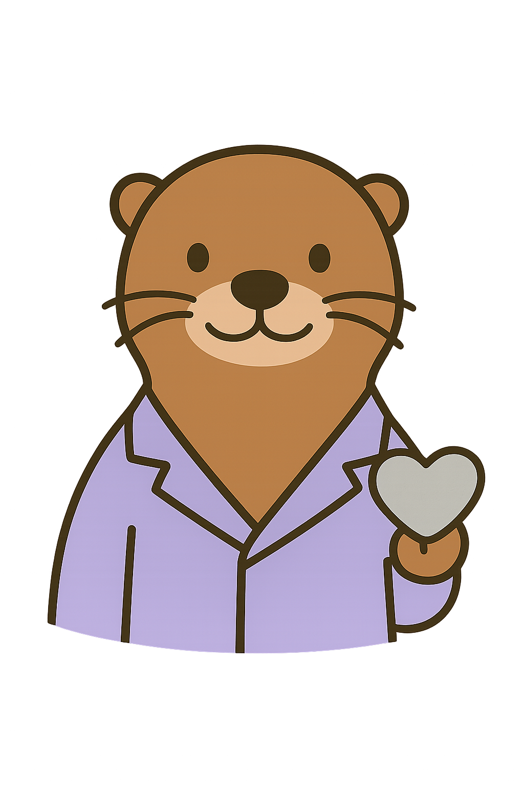

   
# NutriFeliz
Es una aplicación nativa de Android diseñada para simplificar el seguimiento nutricional y conectar a los usuarios con sus planes de alimentación de manera intuitiva y amigable.

<p align="center">
  
</p>

## 🛠️ Tecnologías
* 🅺 [Kotlin](https://kotlinlang.org/)
* 🤖 [Android Studio](https://developer.android.com/studio?hl=es-419)
* 🗃️ Arquitectura **MVVM** (Model-View-ViewModel)

### ⚙️ Funcionalidades Principales
* **Autenticación:** Login y registro seguro de usuarios.
* **Dashboard:** Visualización rápida de metas diarias.
* **Planes Nutricionales:** Vista detallada de comidas y porciones.
* **Perfil:** Gestión de datos del usuario.
---
## 📂 Estructura del proyecto
* ```/app/src/main/java``` Aquí está todo el código Kotlin
* ```/app/src/main/res``` Los diseños, colores e iconos
* ```/gradle``` Archivos de configuración de dependencias
  
## 🚀 Guía de Instalación y Ejecución
### 1. Prerrequisitos
* **Android Studio** (Última versión).
* **JDK 17** o superior (configurado en el IDE).
* Un dispositivo físico Android o un Emulador configurado (API 26+).

### 2. Clonar el repositorio
```bash
git clone https://github.com/4mnesia/NutriFeliz.git

```
### 3. Sincronización con Gradle
* Abre Android Studio.
* Selecciona Open y busca la carpeta NutriFeliz que acabas de clonar.
* Deja que Gradle descargue las dependencias automáticamente.

### 4. Ejecución
Presiona el botón verde Run (▶️) en la barra superior de Android Studio.
